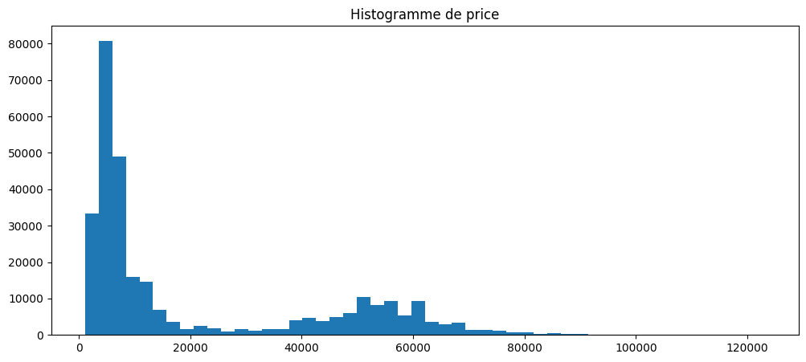
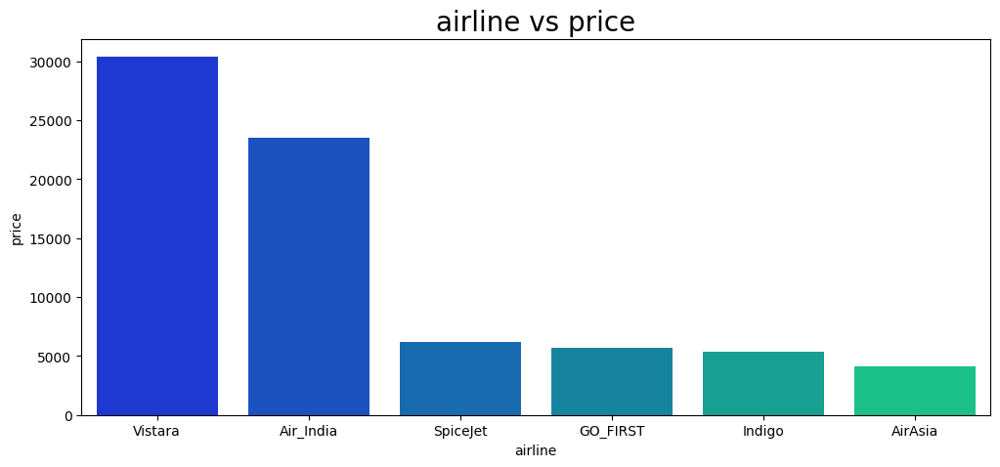
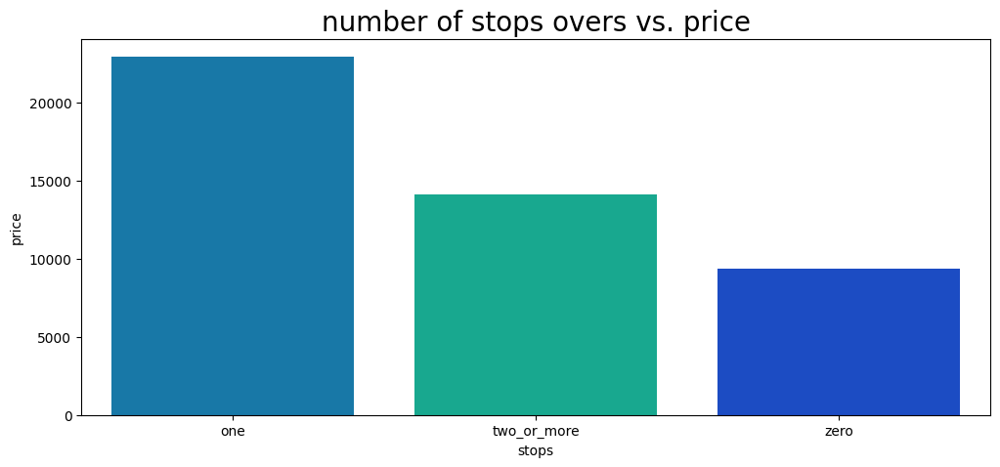
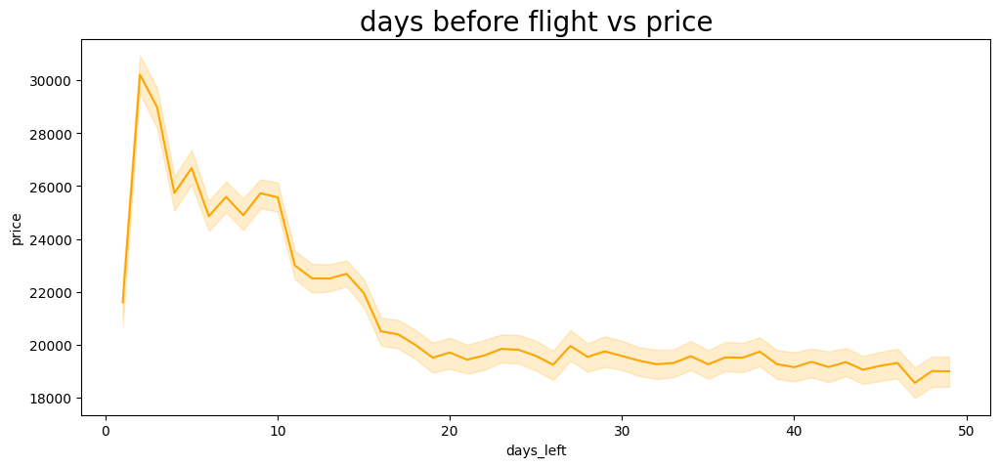
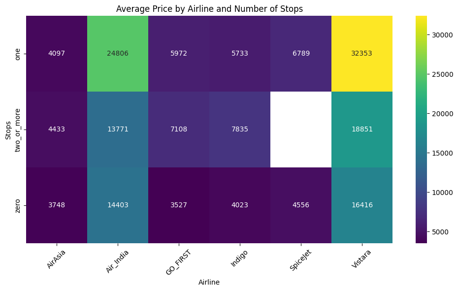
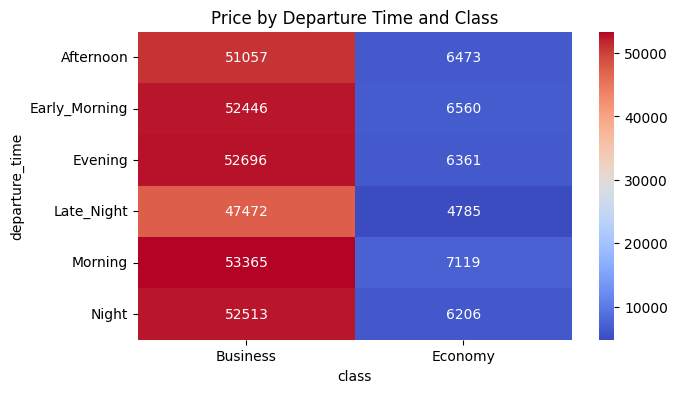

# ✈️ Flight Ticket Price Prediction

Predicting Indian domestic flight prices using machine learning, built as part of the Simplon Maghreb × Jobintech Data Analysis bootcamp.

---

## 📌 Objective

Build a regression model that predicts flight ticket prices with a **MAE under 1,250 INR (~15€)**, based on 300,000+ booking records from Indian domestic airlines.

---

## 📁 Repository Structure

```
├── Airline_Ticket_Prices_EDA.ipynb   # Exploratory Data Analysis
├── tests_statistic.ipynb             # Statistical hypothesis testing
├── model.ipynb                       # Preprocessing, modeling & evaluation
├── load_model.py                     # Example script for loading & using the model
├── model_metadata.json               # Saved model metrics and feature info
├── Clean_Dataset.csv                 # Source dataset
└── Documentation/                    # Additional project documentation
```

> 💾 The trained model (`.joblib`) is hosted externally due to file size — see [Model.joblib](https://limewire.com/d/3SUwK#tDmemuKh9k)

---

## 📊 Dataset

| Property | Value |
|---|---|
| Source | Indian domestic flight bookings |
| Records | 300,000+ |
| Target | `price` (INR) |

**Features:**

| Variable | Type | Description |
|---|---|---|
| `airline` | Categorical | Carrier name (AirAsia, Vistara, IndiGo, etc.) |
| `source_city` | Categorical | Departure city |
| `destination_city` | Categorical | Arrival city |
| `departure_time` | Ordinal | Time-of-day slot (Early Morning → Late Night) |
| `arrival_time` | Ordinal | Time-of-day slot (Early Morning → Late Night) |
| `stops` | Ordinal | zero / one / two_or_more |
| `class` | Ordinal | Economy / Business |
| `duration` | Continuous | Flight duration in hours |
| `days_left` | Continuous | Days between booking and departure |
| `price` | Continuous | Ticket price in INR (**target**) |

---

## 🔍 Project Phases

### 1. Exploratory Data Analysis (`Airline_Ticket_Prices_EDA.ipynb`)

- Variable type classification (continuous, discrete categorical, ordinal)
- Missing value and duplicate checks
- **Univariate analysis**: histograms, boxplots, and bar charts for all variables
- **Multivariate analysis**: relationships between each feature and price

**Price distribution — bimodal structure reflecting Economy vs Business classes:**



**Airline vs average price — Vistara and Air India occupy the premium segment:**



**Stops vs average price — more stops correlates with higher price:**



**Days before flight vs price — prices spike sharply within 5 days of departure:**



**Average price by airline and number of stops — Vistara commands a consistent premium across all stop configurations:**



**Price by departure time and class — ticket class is the dominant price driver, departure time has marginal effect:**



**Key insights:**
- `class` is the dominant price driver — Business tickets average ~8x more than Economy
- Booking within 5 days of departure causes a sharp price spike (~30,000 INR peak)
- Vistara is the most expensive airline across all stop counts
- More stops generally correlates with higher prices, likely due to premium airline routing

### 2. Statistical Hypothesis Testing (`tests_statistic.ipynb`)

| Test | Variables | Result |
|---|---|---|
| Pearson correlation | `duration` vs `price` | r = 0.20, p ≈ 0 → significant but weak correlation |
| ANOVA | `airline` vs `price` | F = 17,194, p ≈ 0 → significant price differences across airlines |
| ANOVA | `stops` vs `price` | F = 6,477, p = 0 → significant price differences across stop counts |
| Chi-square (independence) | `departure_time` vs `stops` | p ≈ 0 → the two variables are dependent |
| Chi-square (goodness of fit) | AirAsia market share | Rejects H0 of 70% share — actual share is significantly different |

### 3. Modeling (`model.ipynb`)

**Preprocessing:**
- Ordinal encoding: `stops` (0/1/2), `class` (0/1)
- OneHot encoding: `airline`, `source_city`, `destination_city`, `arrival_time`, `departure_time`
- Standard scaling: `duration`, `days_left`
- Train/test split: 80/20

**Model comparison (5-fold cross-validation on training set):**

| Model | Selected |
|---|---|
| Baseline (DummyRegressor) | ❌ |
| Linear Regression | ❌ |
| Ridge Regression | ❌ |
| **Random Forest** | ✅ |

**Final model — Random Forest (n_estimators=50):**

| Metric | Value |
|---|---|
| R² | **0.9857** |
| MAE | **1,063 INR (~12.7€)** ✅ |
| RMSE | 2,722 INR |
| 95% Confidence Interval | [1,043 — 1,083 INR] |

> ✅ Business objective achieved: MAE < 1,250 INR (equivalent to ~15€)

---

## 🛠️ Tech Stack

- **Python 3.14**
- **pandas / NumPy** — data manipulation
- **Matplotlib / Seaborn** — visualization
- **scikit-learn** — preprocessing, modeling, evaluation
- **SciPy** — statistical tests
- **joblib** — model serialization
- **uv** — package management

---

## 🚀 Usage

### Load the model and predict

```python
import joblib
import pandas as pd
import numpy as np

pipeline = joblib.load("flight_price_pipeline.joblib")
encoder = pipeline["encoder"]
scaler  = pipeline["scaler"]
model   = pipeline["model"]

new_flight = {
    'airline': ['Vistara'],
    'source_city': ['Delhi'],
    'destination_city': ['Mumbai'],
    'departure_time': ['Evening'],
    'arrival_time': ['Night'],
    'stops': [1],          # 0=zero, 1=one, 2=two_or_more
    'class': [0],          # 0=Economy, 1=Business
    'duration': [2.5],
    'days_left': [15]
}

df_input = pd.DataFrame(new_flight)

categorical_cols = ['airline', 'source_city', 'destination_city', 'arrival_time', 'departure_time']
numerical_cols   = ['duration', 'days_left']
ordinal_cols     = ['class', 'stops']

encoded = encoder.transform(df_input[categorical_cols])
scaled  = scaler.transform(df_input[numerical_cols])

X_input = np.concatenate([df_input[ordinal_cols].values, scaled, encoded], axis=1)

predicted_price = model.predict(X_input)
print(f"Predicted price: {predicted_price[0]:,.0f} INR")
```

---

## 👥 Team

Built by the **Data-Analysis-Hub** team as part of the Simplon Maghreb × Jobintech Data Analyst training program (Cohort 2026).